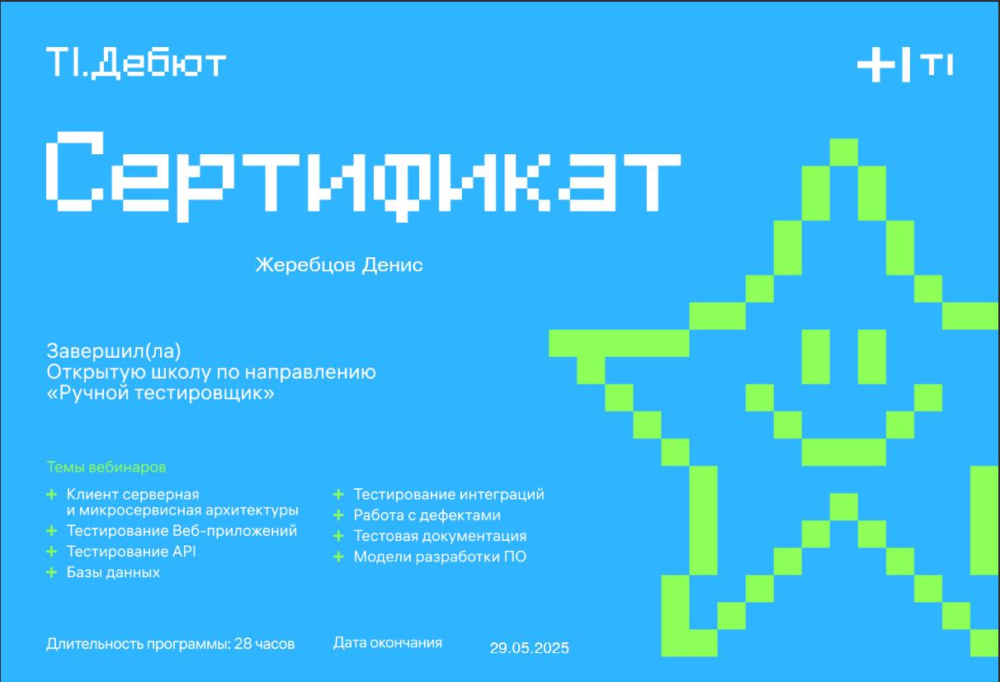
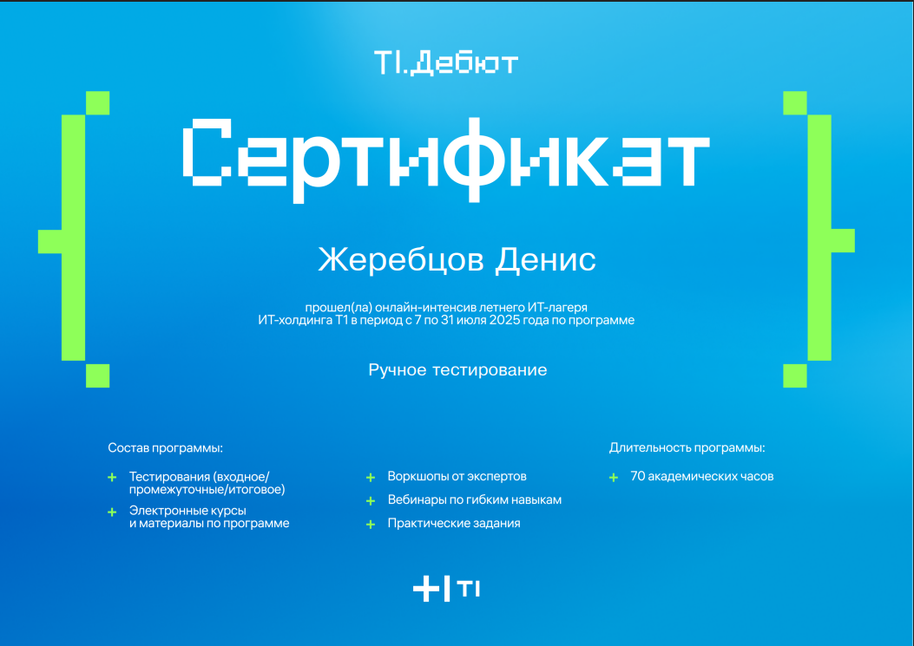
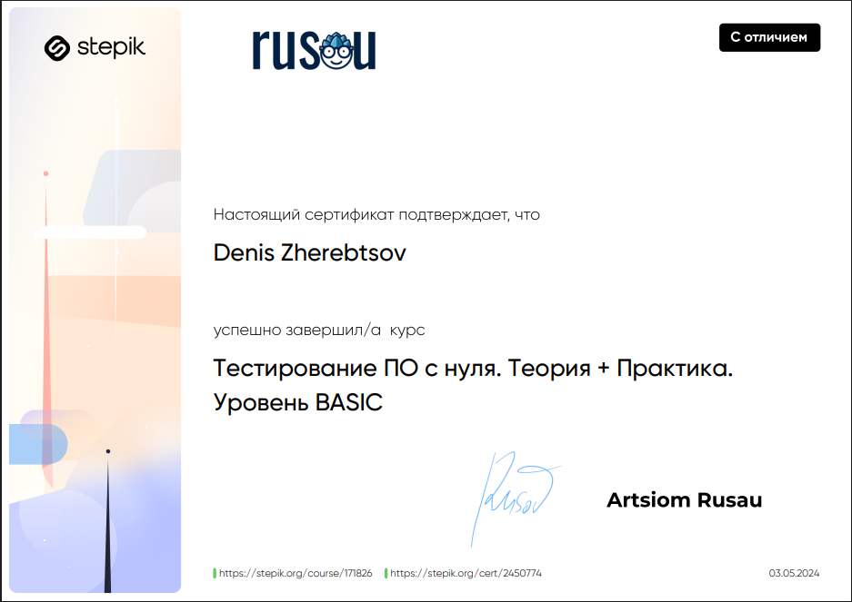
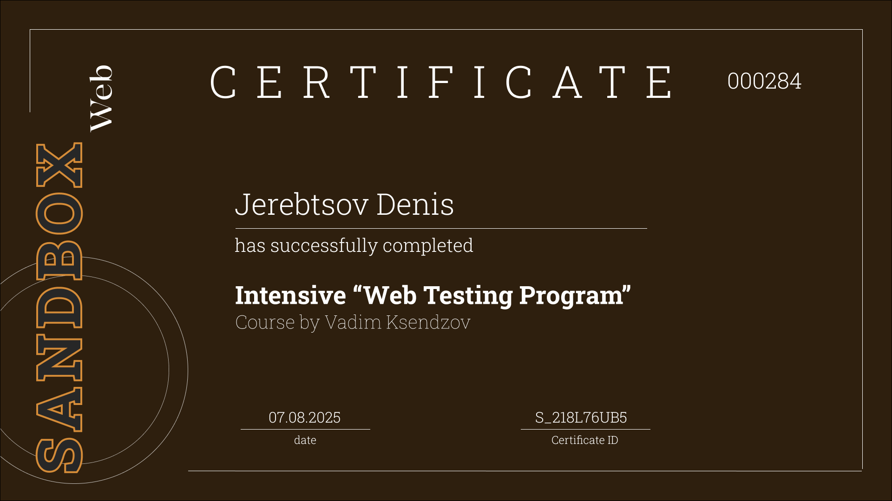
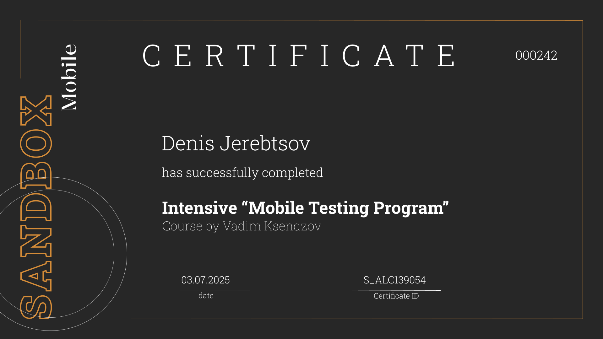

[⬅️ вернуться на главную](https://github.com/denjervu)

# Повышение квалификации

# Открытые школы от холдинга T1 по направлению "Ручной тестировщик"

[Ссылка на информацию об открытых школах](https://career.t1.ru/debut/open-school)

# ИТ-лагерь от холдинга Т1 по направлению "Ручной тестировщик"

[Ссылка на информацию о лагере](https://career.t1.ru/debut/camp)

# Тестирование ПО. Теория + Практика. Автор: Артем Русов
[Ссылка на программу подготовки](https://stepik.org/course/171826/syllabus)

# Интенсив «Sandbox Web». Автор: Вадим Ксендзов

- Выполнил практические задачи c DevTools  
- Составил точные баг-репорты на английском языке
- Развил soft skills в командной работе
- Сделал Мини-проект на HTML и CSS

# Интенсив «Sandbox Mobile». Автор: Вадим Ксендзов

 - Изучил Guidelines (Human Interface, Material Design)
- Прокачался в командной работе
	- Разработал глоссарий в Figma (документ с названиями всех экранов и элементов приложения)
	- Составил mind-map всех переходов приложения
- Выполнил задания с Charles Proxy
- Сделал задачи с тестовой документацией на английском языке: баг-репорты, тест-кейсы, чек-листы

